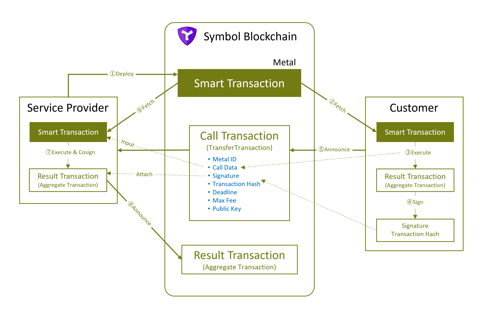

# Smart Transaction for Symbol (PoC)

***・・・Symbol は DApps の夢を見るか？・・・***

> 本リポジトリは実証コードにつき実用には堪えません。
> コードは整備されていない状態である事に留意してください。

## 1. 概要

### 1.1. Smart Transaction とは

Smart Transaction とは、マルチシグトランザクションの署名者間で、トランザクションの動的生成と検証を行うためのプロトコルであり、
ブロックチェーンにデプロイされた「Smart Transaction」と呼ばれるプログラムコードをお互いの環境で実行することで、
トラストレスにマルチシグトランザクションを実行できるようにする技術です。

Smart Transaction のプログラムは WebAssembly 等にコンパイルされ、
[Metal on Symbol](https://github.com/OPENSPHERE-Inc/metal-on-symbol) を使ってブロックチェーンにデプロイされます。

Smart Transaction が実行されると、結果的にブロックチェーンを更新する Aggregate Transaction が生成されます。

Smart Transaction のコードは Metal によってブロックチェーン上に固定されており不変なので、
入力データが同じなら出力も同じになる事を期待できます。

基本的に Smart Transaction はサービスプロバイダーがデプロイするものであり、
顧客が Smart Transaction を実行して「申し込む」図式になります。
従って、サービスプロバイダーが「突然、悪意のある Smart Transaction を送りつけられ署名させられる」事はありません。
つまり、Smart Transaction は、同じマルチシグトランザクション手法である Aggregate Bonded Transaction と比べても、 
多くの点でセキュリティアドバンテージを持ちます。

**もう Aggregate Bonded Transaction は不要です！**

> #### 「スマートコントラクト」との違い
> 
> 何となく「スマートコントラクト」と似たような雰囲気ですが、
> あくまでも Smart Transaction は多者間の合意形成（の手助け）が基本機能になります。
> 
> スマートコントラクトの様な自律性が Smart Transaction にはありません。
> Smart Transaction の実行結果をブロックチェーンに反映する為には、必ず関係者の承認（署名）が必要になります。
> 
> また、スマートコントラクトの様な「コントラクトからのみ書き換え可能なストレージ」は存在せず、
> Smart Transaction のプロトコル外から書き換えられる可能性があることに留意してください。

### 1.2. Smart Transaction の動作原理



#### サービスの準備

1. サービスプロバイダーが Smart Transaction を準備し、コンパイルし、Metal に Forge してブロックチェーンにデプロイします。※①
2. Smart Transaction の Metal ID と、仕様（関数名や引数の仕様）を公開します。
   通常は立派な UI が付いて Web やスマホアプリとして公開されるでしょう。

#### 取引の開始

1. 顧客が自身の環境で Smart Transaction を実行し Aggregate Transaction を生成します。※②③
2. 顧客自身のプライベートキーで Aggregate Transaction へ署名し「トランザクションハッシュ」と「シグネチャー」を取得します
   （トランザクション本体は不要なので捨てます）※④
3. 上で得られたトランザクションハッシュとシグネチャー、及び Smart Transaction のMetal ID・関数名・引数リスト
   （以降 Call Data と呼ぶ）を適切にエンコードして、
   新たに作ったサービスプロバイダー向けの転送トランザクション（のメッセージ） に添付しアナウンスします。<br /> 
   この転送トランザクションを「Call Transaction」と呼びます。※⑤
4. 顧客は、求める Aggregate Transaction がサービスプロバイダーによって実行されるのを待ちます。

#### サービスの提供

1. Call Transaction を受け取ったサービスプロバイダーは、まず Call Transaction のメッセージをデコードして正当なものか検証します。
2. 次に、Call Data を入力として顧客と同じ Smart Transaction を実行し、出力された Aggregate Transaction に「連署」してアナウンスします。
   尚、トランザクションハッシュや顧客のシグネチャー等の必要な情報は Call Transaction に添付されています。※⑥⑦⑧
3. Smart Transaction の実行結果と顧客・サービスプロバイダー双方のシグネチャーが正しければ、ブロックチェーン上でトランザクションが承認され、   
   取引が成立します。万が一、トランザクションの内容またはシグネチャーのどちらかが不正であったならば、ネットワークがトランザクションを否認するので、
   Smart Transaction の結果をサービスプロバイダーが検証する必要はありません。

> 更なる連署が必要な、三者以上のマルチシグトランザクションでは、
> 関係者全員が一様に Smart Transaction を実行し連署する事になるでしょう。
> 
> 本実証コードでは二者のマルチシグのみ実装しています。

### 1.3. Smart Transaction の利点

Symbol ブロックチェーンで多者間のマルチシグトランザクションを実行する場合、
Aggregate Transaction は（特に Aggregate Bonded Transaction では）、
セキュリティ上、必ず署名する前にトランザクションの内容を精査する必要があります。

これは「取引を持ち掛ける側がトランザクションの内容を自由に組み立てる」という点に脆弱性があるためです。

さもなければ、悪意のあるトランザクションに署名させられ、資産を失う危険性があります。
事実、過去にこの脆弱性を利用した、所謂「アグボン詐欺」の被害が拡大しました。

この脆弱性への対策では、

1. トランザクション送信元を信頼できるものに絞る
2. トランザクションの内容を逐一検証する

という手順が必要です。

つまり、これらを対策した上で、
ついでに Aggregate Bonded Transaction の「10 XYM のハッシュロックが必要」というネガを取り去ったのが Smart Transaction です。

Smart Transaction では、ブロックチェーンに固定されたコードがトランザクションを生成することで、
悪意のあるトランザクションが入り込む可能性を排除します。
サービスプロバイダーは、単に同じ Smart Transaction を実行してトランザクションを生成し連署してアナウンスするだけで、
安全にサービスを提供できるというわけです。

**連署の自動化も容易でしょう。**

もう一度言います。**もう Aggregate Bonded Transaction は要りません！**

> そんなものは無かった。いいね？

## 2. 実証コード

実証コードでは簡単なモザイク販売を行うだけの Smart Transaction を実装しています。

また、Smart Transaction を起動するプログラム本体は、Node.js コマンドラインプログラムで実装しています。
従って実行にはまず [Node.js](https://nodejs.org/ja/) のインストールが必要です。

### 2.1. ビルド

> 以降の解説では Node.js 環境がインストール済みである前提です。

#### 1) Rust 開発環境のインストール

Smart Transaction の実態は WebAssembly であり、本リポジトリでは Rust を使ってコーディングされています。
Rust の開発環境と WebAssembly へのコンパイル環境をインストールしてください。

[参考サイト](https://rustwasm.github.io/docs/book/game-of-life/setup.html)

**Rust Toolchain のインストール**

[こちらのサイト](https://www.rust-lang.org/tools/install) で入手してインストールしてください。

**wasm-pack のインストール**

[こちらのサイト](https://rustwasm.github.io/wasm-pack/installer/) で入手してインストールしてください。

#### 2) 実証コードリポジトリのクローン

```shell
git clone https://github.com/OPENSPHERE-Inc/smart-transaction-poc
cd smart-transaction-poc
```

#### 3) WebAssembly コードの編集

[/webasm/simple-exchange/src/lib.rs](./webasm/simple-exchange/src/lib.rs) を開いて冒頭の定数

- `SALE_MOSAIC_ID` - 販売するモザイクID
- `SELLER_PUBLIC_KEY` - 販売元のパブリックキー（イコール、Smart Transaction の所有者）
- `PRICE` - 販売価格 (XYM)

を編集してください。`CURRENCY_MOSAIC_ID` は XYM のモザイクIDなのでそのままでOKです。
尚、使用するモザイクは予め作成しておいてください。

#### 4) WebAssembly のコンパイル

```shell
cd webasm/simple-exchange
wasm-pack build --target web
node tweak-package-json.js
cd ../../
```

`/webasm/simple-exchange/pkg` に wasm ファイルと起動に必要な js ファイル、
TypeScript 型定義ファイル等がパッケージとして生成されます。

#### 5) Node.js パッケージのインストール

WebAssembly のコンパイルで生成されるローカルパッケージ `/webasm/simple-exchange/pkg` を参照するので、
必ずこのタイミングで行います。

```shell
yarn
```

または

```shell
npm install
```

#### 6) 設定

[/dot.env](./dot.env) を `.env` にリネームして編集してください。

```dotenv
NODE_URL=Your node URL here.
BUYER_PRIVATE_KEY=Your private key here.
SELLER_PRIVATE_KEY=Your another private key here.
```

`SELLER_PRIVATE_KEY` は Smart Transaction のデプロイ時と同じものを設定してください。
`BUYER_PRIVATE_KEY` は適度な XYM が必要です。


#### 7) Smart Transaction のデプロイ

Metal の CLI をインストールしてください。

```shell
npm install -g metal-on-symbol
```

次に wasm ファイルを Forge してデプロイします。

```shell
metal forge  -o src/metal.json  webasm/simple-exchange/pkg/simple_exchange_wasm_bg.wasm
```

プライベートキーが聞かれるので入力してください。
このアカウントが Smart Transaction の所有者となります。

尚、Metal ID はコードに自動で反映されるので控える必要はありません。

#### 7) Node.js プログラムのビルド

```shell
yarn build
```

#### 8) プログラムの実行

まず、seller プログラムを起動して待機状態としてください。無限ループなので、終了させる場合は Ctrl+C してください。

```shell
node dist/seller.js
```

seller がスタートしたら、buyer プログラムを起動します。

```shell
node dist/buyer.js
```

起動すると、モザイク購入が実行されます。

Call Transaction が送信されブロックチェーンで承認されると、
自動的に seller プログラムが Smart Transaction にサインバックして取引が完了します。

## 3. ソースコード解説

### 3.1. [/webasm/simple-exchange/src/lib.rs](./webasm/simple-exchange/src/lib.rs)

Rust で書かれた Smart Transaction 本体です。

Rust コードの深堀はしませんが、`exchange` という関数が JavaScript から呼び出されます。
数値は `u128` あたりで扱いたいのですが、wasm-bindgen が対応してないので JavaScript の `number` に相当する `f64` で妥協しています。
数字が大きくなると精度が足りなくなるかもしれません。

スマートコントラクトのようにオンチェーンの情報を検証して、残高が足りない等の問題があれば失敗します。

`getAccountBalance` でオンチェーンのデータを取得します。
現状はオンデマンドで取りに行きますが、Smart Transaction 呼出前に取得して揃えて渡す様にしてもいいかもしれません。

`transferMosaic` 関数で転送トランザクションを生成しています。
スマートコントラクトと違い、このプログラムの時点で転送は発生しません。
トランザクション実行にサービスプロバイダーの署名が必要です。

上記二つの関数は、後述する JavaScript 側のグローバル関数を呼び出します。

### 3.2. [/src/services/smarttx.ts](./src/services/smarttx.ts)

#### ・call 関数

Call Transaction を送信する関数です。
ポイントとしては独自の署名用関数 `signTx` を用意し、トランザクションハッシュとシグネチャーのみを取り出せるようにしています。
`SignedTransaction` になってしまうとトランザクションハッシュとペイロードになってしまうためです。

`TransferTransaction` を作って以下の情報を JSON 化し、メッセージに添付してアナウンスまで行います。
今のところ500バイト程度なので問題ないですが、サイズが大きくなるようなら複数トランザクションに分割する必要があるでしょう。

```typescript
export interface CallData {
    method_name: string;  // "exchange" 固定
    arguments: any[];
}

export interface CallTransactionPayload {
    type: string;  // "smart" 固定
    metal_id: string;
    hash: string;
    deadline: number;
    max_fee: string;
    signer_public_key: string;
    signature: string;
    call_data: CallData,
}
```

Smart Transaction が生成するトランザクションの内容に加えて `deadline` と `max_fee`、`signer_public_key` が同じであれば、
ハッシュ・シグネチャーも同一になります（本プロトコルのキーポイント）

`method_name` でメソッドが指定できるように見えますが、それは将来的な想定であって、今のところ `exchange` 固定です。

#### ・fulfill 関数

サービスプロバイダーが、顧客から受信した Call Transaction をもとに Smart Transaction を履行する関数です。

`AggregateCompleteTransaction` を生成する際に、受信した `deadline`、`max_fee`、`signer_public_key`、`signature` を渡します。

ポイントとしては、顧客のプライベートキーが必要な署名はできないので、
シリアライズされたトランザクションペイロードから `SignedTransaction` を生成するための関数 `createSignedTx` を自作しています。

次に、Call Transaction で受信した `hash` に対して `CosignatureTransaction.signTransactionHash()` で、
サービスプロバイダーのプライベートキーで連署してシグネチャーを得ます。

最後に `SignedTransaction` とサービスプロバイダーのシグネチャーでもって、トランザクションをアナウンスします。

全ての情報が正しければ、ブロックチェーンでトランザクションが承認されることでしょう。
そして、不信な部分があればトランザクションは拒否されます。

#### ・global.getAccountBalance、global.transferMosaic 関数

WebAssembly から呼び出される Symbol ライブラリ関数です。今のところこの二つだけ用意しています。

- `global.getAccountBalance` - アカウントのモザイク残高を取得する
- `global.transferMosaic` - 転送トランザクション

当然実用を考えるなら、Symbol のほぼすべての機能を用意しなくてはならないでしょうが、それは今後の課題です。

またグローバル関数にしている理由は、
Rust と JavaScript を繋ぐ [wasm-bindgen](https://rustwasm.github.io/docs/wasm-bindgen/) の仕様に取り合えず合致させる、
その場しのぎ対応です。

> wasm-pack もブラウザーが中心で、Node.js で使用される事があまり想定されてないのでめんどくさかった。

生成されたトランザクションはグローバル変数 `transactions` に入れています。
**従って、同時に複数の Call Transaction を受信できる想定にはなってません。**

### 3.3. [/src/buyer.ts](./src/buyer.ts)

「顧客側」を想定した CLI プログラムです。

Metal から Smart Transaction を取得して起動します。
`SmartTransactionService` にトランザクションが生成されるので、`call` を呼び出して署名し、Call Transaction をアナウンスします。

冒頭の定数 `buyAmount` で、購入するモザイクの量を設定できます。 

### 3.4. [/src/seller.ts](./src/seller.ts)

「サービスプロバイダー側」を想定した CLI プログラムです。

サービスプロバイダーへのトランザクションを監視して Call Transaction を受信します。

Call Transaction が来たらデコードしてメッセージ JSON の型を検証します。
エラーならトランザクションを無視します。

メッセージに添付された `deadline` で `SmartTransactionService` を初期化します。
更に `metal_id` で Smart Transaction を取得して、`call_data` を使用して起動します。

`SmartTransactionService` にトランザクションが生成されるので、`fulfill` を呼び出してトランザクションに連署してアナウンスします。

本プログラムは無限ループなので、Ctrl+C で終了してください。

## 4. 課題と今後

実証コードでは課題が多く、まだまだ実用まで掛かりそう、といったところです。

完成までは

- 三者以上のマルチシグ対応
- WebAssembly ランタイム（現 SmartTransactionService）の整備、Symbol ライブラリの整備、セキュリティ検証。
- Smart Transaction 開発環境の整備。恐らく wasm-bindgen と似たような専用の処理系が必要でしょう。
- ドキュメントの整備
- 対応ウォレットの開発
- Etherscan の様な Smart Transaction のインスペクションサイト

等などが必要かと思います。

以上、何か質問等ありましたら Discussion へ、不具合等は Issue へお寄せいただければと思います。

本リポジトリは MIT ライセンスといたします。
